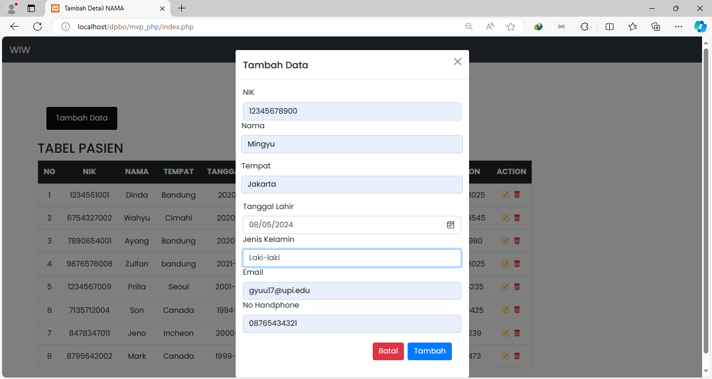

**Saya Nabilla Assyfa Ramadhani [2205297]  mengerjakan LP11 dalam mata Desain dan Pemograman Berorientasi Objek untuk keberkahanNya maka saya tidak melakukan kecurangan seperti yang telah dispesifikasikan. Aamiin**

# Desain Program
Program dibuat menggunakan PHP dengan mengimplementasikan MVP (Model, View, Presenter). Berikut merupakan komponen - komponen program ini :
1. Model
    - **`DB.class`** : Digunakan untuk menghubungkan dengan database. 
    - **`Pasien.class`** : Berisi metode - metode untuk mengambil data pasien
    - **`TabelPasien.class`** : Digunakan untuk mengelola data pasien menggunakan database.
    - **`Template.class`** : Digunakan untuk membuat koneksi ke halaman template.
2. View
    - **`KontrakView`** : Digunakan sebagai kelas interface.
    - **`TampilPasien`** : Digunakan untuk menampung metode - metode untuk menampilkandata kelayar
3. Presenter
    - **`KontrakPresenter`** :  Digunakan sebagai kelas interface.
    - **`ProsesPasien`** : Digunakan untuk mengontrol alur bisnis tabel pasien.
4. Template
    - **`skin.html`** : Digunakan untuk menampilkan data pasien serta form untuk menambah data.  
    - **`skinform.html`** : Digunakan untuk menampilkan form update dan delete pasien.

# Alur Program
### Tambah Data
1. User membuka halaman utama web
2. Saat user menekan tombol `tambah data`, program akan menampilkan formulir penambahan data
3. Pengguna diminta untuk mengisi field yang tersedia, jika sudah selesai pengguna dapat menekan tombol `tambah`.
4. Presenter menerima dan memvalidasi data yang diterima dari formulir. Kemudian menyimpannya dalam database.
5. Jika penyimpanan data berhasil, presenter akan mengarahkan view untuk menampilkan konfirmasi bahwa data berhasil ditambah.

### Ubah Data
1. Ketika user menekan icon `pensil/ubah`, maka program akan menampilkan formulir ubah data.
2. Pengguna dapat melakukan modifikasi pada data yang ingin diubah.
3. Setelah selesai melakukan perubahan, pengguna dapat menekan tombol "Ubah" untuk menyimpan perubahan tersebut.
### Hapus Data
1. Jika pengguna menekan tombol `hapus` untuk menghapus data, program akan menampilkan formulir konfirmasi untuk menghapus data.
2. Jika pengguna mengkonfirmasi penghapusan, data akan dihapus dari database.

# Dokumentasi Program
#### Menampilkan email dan no handphone beserta atribut lain

#### Tambah data

#### Ubah Data

#### Hapus Data
